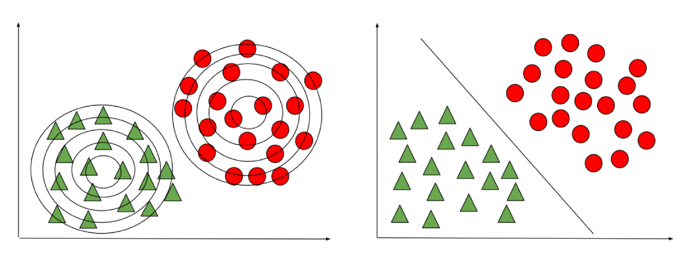
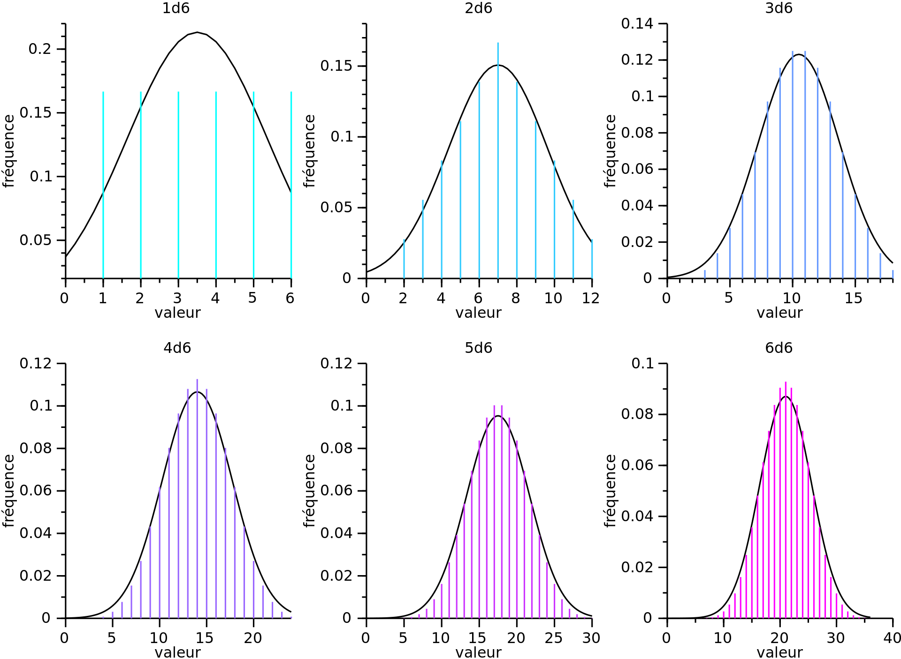
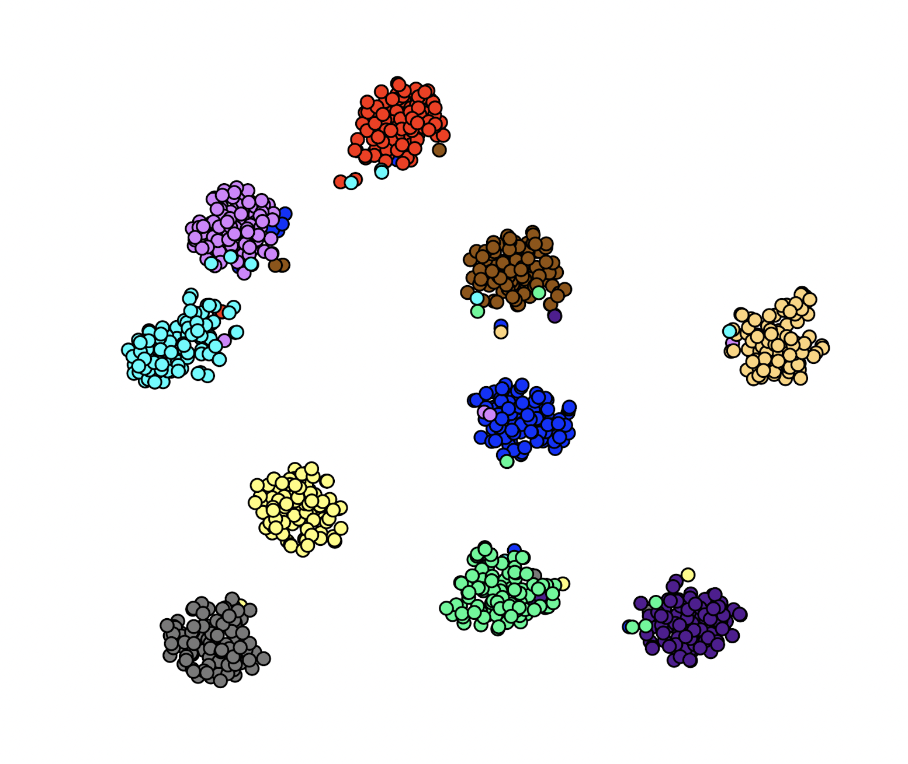
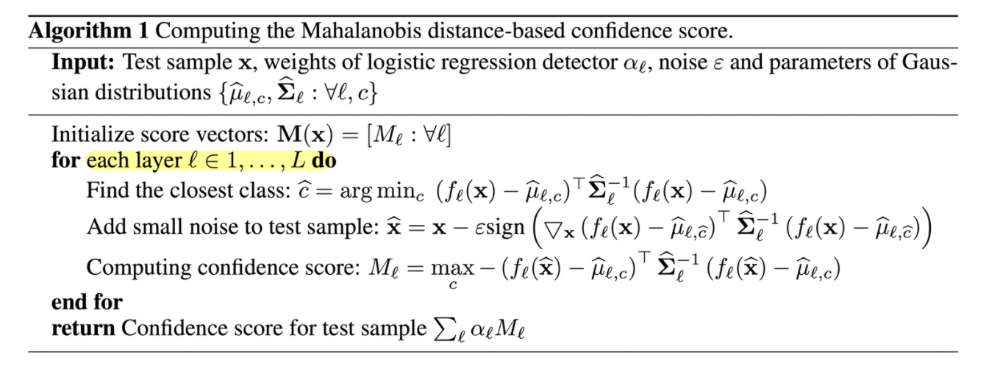
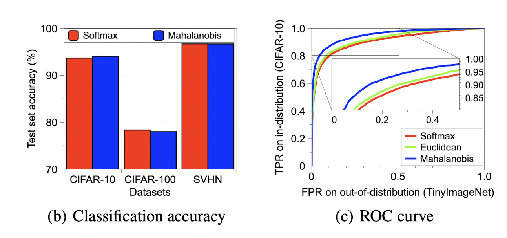
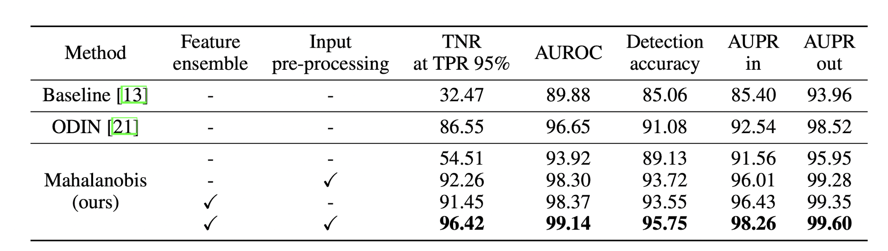
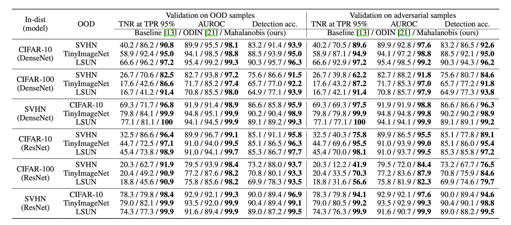
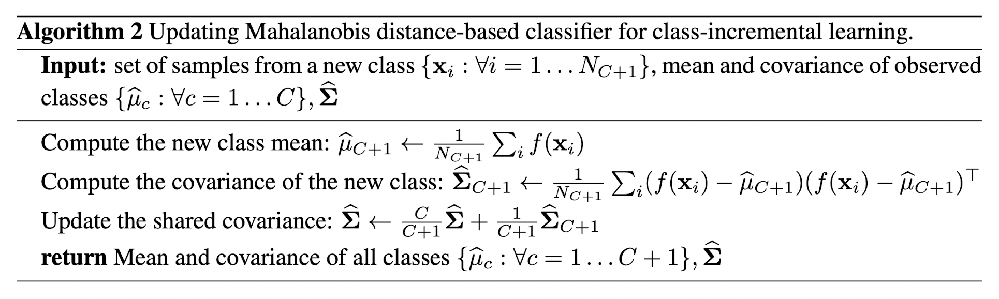
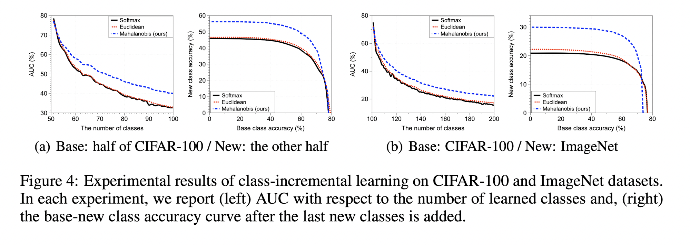

<!-- _color: white -->

# A Simple Unified Framework for Detecting Out-of-Distribution Samples and Adversarial Attacks
###### Kimin Lee, Kibok Lee, Honglak Lee, Jinwoo Shin 
 

> Grepp
  Zayden

---

## 목차

1. Intorduction
2. Mahalanobis distance based classifier
3. Calibration techniques
4. Experiments
5. Q&A

---
# Intorduction

---

# 문제 정의
이미지 $P_\bold{X}$와 $Q_\bold{X}$가 $P_\bold{X} Q_\bold{X} \in \mathcal{X}$일때  
혼합 분포를 가지는 새로운 이미지 $\mathbb{P}_{\bold{X}|Z} \in \mathcal{X} \times {(0, 1)}$가 아래와 같을때,
 
 - $\mathbb{P}_{\bold{X}|Z=0} =P_\bold{X}$ -> In distribution
 - $\mathbb{P}_{\bold{X}|Z=1} =Q_\bold{X}$ -> Out distribution

 

-> $\mathbb{P}_{\bold{X}|Z}$ 분포를 가진 이미지 $\bold{X}$가 주어지면 이 이미지를 $P_\bold{X}$인지 아닌지 분류할 수 있을까?

---
# Supervised Learning algorithm

1. <b>Discriminative Learning Algorithms</b>
   - 다른 class 사이의 결정 경계를 찾아서 분류를 수행
   - Logistic Regression, Perceptron Algorithm, etc ...
2. <b>Generative Learning Algorithms</b>
   - 각 class의 분포(가우시안 분포를 가정)를 이용해서 class를 분류
   - GDA
---

## GLA vs DLA

---

# 사후 확률 (Posterior distribution)
softmax 기반 분류 모델의 사후 확률은 softmax classifier로 이루어져있음.
 
 

$$P(y= c|x) = \frac{\text{exp}(\text{w}_c^\intercal f(\text{x}) + b_c)}{\sum_{c^{'}} \text{exp}(\text{w}_{c^{'}}^\intercal f(\text{x}) + b_{c^{'}})},$$
 

-> 이를 Malhalanobis distance 기반 classifier로 대체하여 confidence score $M(\text{x})$ 와 추측 class $\hat y(\text{x})$를 구한다.

---

# 중심 극한 정리 (린데베르그-레비)

확률변수 $X_1$, $X_2$, ... 들이 서로 독립적이고, 같은 확률 분포를 가지고 그 확률분포의 기대값($\mu$)과 표준편차($\sigma$)가 유한하면 $X_1$, $X_2$, ... 평균의 분포는 정규분포를 따른다.

---
# GDA에서의  사후 확률

- 사후 확률은 사전 확률과 가능도의 곱으로 나타낼 수 있음.
$P(w_i|x)$=$P(w_i)$ $p(x|w_i)$
 

- $w_i$가 N차원의 공간에서 가우시안 분포를 가질때 가능도 $P(w_i)$ (likelihood)
$$p(x|w_i) = N(\mu_i, \Sigma_i) = {1\over(2\pi)^{d/2}|\Sigma_i|^{1/2}} \exp(-{1 \over 2}(x-\mu_i)^T\Sigma_i^{-1}(x- \mu_i))$$

---
$P(w_i|x)= \ln(f(x)) = \ln(p(x|w_i)P(w_i)) = \ln(N(\mu_i, \Sigma_i))+\ln(P(w_i))$
 

클래스 별 prior와 covariance가 동일하다면 상수항 제거
$P(w_i|x)= -{1 \over 2}(x-\mu_i)^T\Sigma_i^{-1}(x- \mu_i)$ $-{d \over 2} \ln(2 \pi) -{1 \over 2} \ln(|\Sigma_i|) + \ln(P(w_i))$

---

# Mahalanobis Distance
x가 주어졌을때 평균 벡터 $\mu_i$와 공분산 행렬 $\Sigma_i$를 갖는 가우시안 분포와의 거리
   

$$((x-\mu_i)^T\Sigma_i^{-1}(x- \mu_i))^{0.5}$$
    

---
# Mahalanobis distance based classifier

---
## 학습된 모델에 Mahalanobis Distance를 어떻게 적용시킬까?

- softmax classifier로 학습된 모델에 사용된 training data 샘플로부터 각 class의 평균과 전체 데이터에 대한 공분산 행렬을 계산
 
$$\hat{\mu}_c = \frac{1}{N_c} \sum_{i:y_i=c} f(\text{x}_i),$$
$$\hat{\Sigma} = \sum_c \sum_{i:y_i=c} (f(\text{x}_i) -\hat{\mu_c})(f(\text{x}_i) -\hat{\mu_c})^\intercal$$

---
## Mahalanobis distance-based confidence score
   

confidence score $M(\text{x})$는 가장 가까운 class 분포와 Mahalanobis distance 로 계산
$$M(\text{x}) = \max_{c}- (f(\text{x}_i) -\hat{\mu_c})^\intercal \hat\Sigma^{-1}(f(\text{x}_i) -\hat{\mu_c}).
$$
 
-> 거리가 가까워지면 (작아지면) confidences score는 더 커짐

---
## Mahalanobis distance based classifier
  

추측 class  $\hat y(\text{x})$는 거리가 가장 가까운 class conditional distribution의 class를 할당
$$ \hat y(\text{x}) = \arg \min_{c}(f(\text{x}) -\hat{\mu_c})^\intercal \hat\Sigma^{-1}(f(\text{x}) -\hat{\mu_c}).
$$

---
## OOD detection
이때 $M(\text{x})$가 특정 threshold 보다 높은 경우 $\text{x}$는 positive로 결정(i.e. in-distribution) 낮은 경우는 OoD로 결정

---
# Calibration techniques
   
---
# Input pre-processing
입력 이미지에 대한 softmax score를 높이는 방향으로 perturbation을 추가한다.

- ### ODIN
$$\tilde{x}=x-\epsilon sign(-\nabla_xlogS_{\hat y}(x;T)),$$

- ### Here
$$\begin{aligned}
\hat{\text{x}} &= \text{x} - \epsilon sign(-\nabla_\text{x}M(\text{x})) \\ &= \text{x}-\epsilon sign(\nabla_\text{x}(f(\text{x}_i) -\hat{\mu_{\hat{c}}})^\intercal \hat\Sigma^{-1}(f(\text{x}_i) -\hat{\mu_{\hat{c}}})),
\end{aligned}$$
---

# Feature ensemble
low-level feature를 추가적으로 뽑아내서 성능을 더 향상시킴

$\ell$번째 히든 feature를 $f_{\ell}(\text{x})$라고 하면, 클래스 평균$\hat{\mu_{\ell, c}}$과 tied(동일한 shape을 가진) 공분산$\hat{\Sigma_{\ell}}$을 계산하고 각 테스트 샘플 $\text{x}$에 대해 $\ell$번째 레이어의 confidence score를 계산.

---

- 마지막 레이어에 비해서 더 좋은 교정된 결과를 얻는 경우가 있다.

- 논문에서 진행한 실험에서는 모든 dense 또는 residual block의 마지막에서 confidence score를 계산하였고 average pooling을 통해서 $\mathcal{F} \times \mathcal{H} \times \mathcal{W} \rightarrow \mathcal{F} \times 1$으로 크기를 줄이고 logistic regression을 통해서 confidence score를 계산한다.
  - logistic regression detector는 in-distribution 및 OoD로 이루어진 valdiation set을 교차 검증해서 학습된다.

---

---
# Experiments

---

---

---

# class incremental learning task
새로운 class가 추가되었을때 학습시키는 방법

---

- Softmax는 [4]의 방법으로, Euclidean은 class 평균만 가지고 계산

---
# Q&A

---
### References
- <comp>[1] www.geeksforgeeks.org/gaussian-discriminant-analysis/</comp>
- <comp>[2] gaussian37.github.io/ml-concept-gaussian_discriminant/</comp>
- <comp>[3] github.com/pokaxpoka/deep_Mahalanobis_detector/blob/90c2105e78c6f76a2801fc4c1cb1b84f4ff9af63/lib_generation.py</comp>
- <comp>[4] Mensink, Thomas, Verbeek, Jakob, Perronnin, Florent, and Csurka, Gabriela. Distance-based image classification: Generalizing to new classes at near-zero cost. IEEE transactions on pattern analysis and machine intelligence, 2013.</comp>

