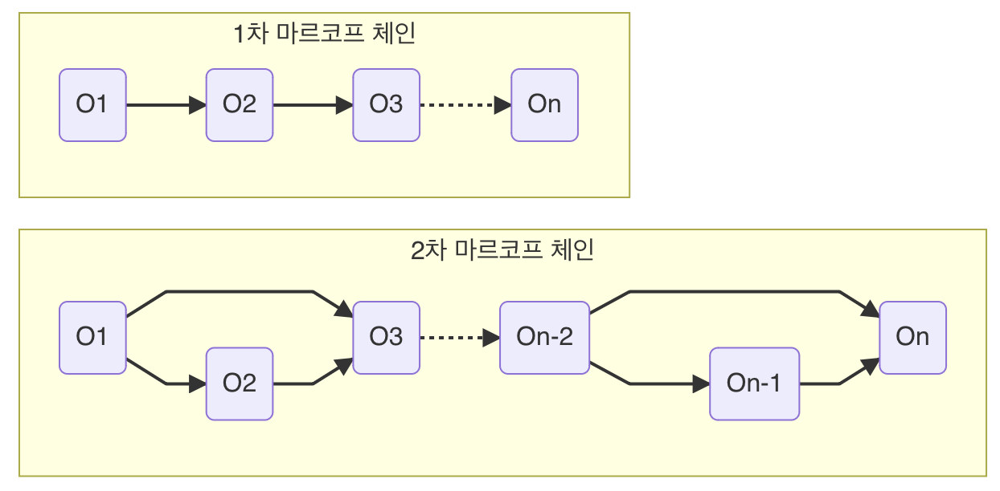

<!-- _color: white -->

# Deep Unsupervised Learning using Nonequilibrium Thermodynamics
###### Jascha Sohl-Dickstein, Eric A. Weiss, Niru Maheswaranathan, Surya Ganguli 

 

> Grepp
  Zayden

---

## 목차

1. Abstract
2. Introduction
3. Algorithm
4. Experiments

---
<!-- _header: Stable diffusion -->
# Stable diffusion

---
<!-- _header: Stable diffusion -->

---
<!-- _header: Stable diffusion -->
# Diffusion model

 

---
# Abstract

---
<!-- _header: Abstract -->

- 머신러닝에서 많은 데이터들을 통해서 모델을 만들게 되는데, 이때 중요한점은 **flexibility**(데이터에 얼마나 잘 맞는지)와 **tractability**(계산적으로 다루기 쉬운지)가 중요하다. 
- non-equilibrium statistical physics에서 영감을 받아서 generative 모델을 만들었다.
- 데이터의 분포를 **천천히 파괴하고 복구**하는 과정에서 다루기 쉽고 데이터와 잘 맞는 생성모델을 만들 수 있다.

---

# Introduction

---
<!-- _header: Introduction -->
다루기 쉬운 모델은 분석적으로 평가할 수 있고 쉽게 데이터에 모델을 맞출 수 있지만 거대한 데이터셋에서는 맞추기 어려운 점이 있다. 유연한 모델은 반대로 데이터 구조에 맞게 변경할 수 있다.

다음과 같은 함수가 있을때,

non-negative function $\phi(x)$, normalization constant $Z$,

$$p(x) = { {\phi(x)} \over {Z} }$$

- 데이터 구조에 맞게 분포를 설명할 수 있지만 $Z$를 구하는 것은 어렵다(intractable).

<!--_footer: Normalization constant는 함수의 적분값이 1이 되게 하는 상수 -->

---
<!-- _header: Introduction : diffusion probabilistic models  -->
## diffusion probabilistic models

논문에서 제안하는 예측 모델을 정의하는 새로운 방법

1. 모델 구조가 유연하다.
2. 정확하게 표본을 추출할 수 있다.
3. 다른 분포와의 multiplication이 쉽다. (posterior probability등, **inpainting** 이나 **denoising**에 사용될 수 있음)
4. 모델이 log-likelihood이고 개별 상태를 **평가비용이 적다**(likelihood 함수는 직관적이고 관측결과로 쉽게 계산이 가능하다).

---
<!-- _header: Introduction : diffusion probabilistic models  -->
논문에서는 차례적으로 분포를 파괴하는 단계를 거치는데 이때 **마르코프 체인**을 활용.
단계별로 확률적으로 해석할 수 있고 분석 평가 가능.

---
<!-- backgroundColor: Ghostwhite -->
# Appendix 1: Markov chain
---
<!-- _header: Appendix 1: Markov chain  -->
마르코프 체인은 각 전 상태가 현재의 상태에 영향을 미치는 성질을 이용한 과정.
- ex) 어제 비가올 확률이 n% 일때, 오늘 비가 올 확률

n차 마르코프 체인은 상태 전이 확률(State transition Probability) $P(o_t|o_{t-1}o_{t-2}..{o_1})$ 로 나타낼 수 있고 아래 그림처럼 표현할 수 있다.

---
<!-- _header: Appendix 1: Markov chain  -->
### 날씨에 마르코프 체인 적용해보기

오늘 날씨($o_{t-1}$)에 대한 내일 날씨($o_t$)의 확률이 다음과 같다고 가정.

 

| 오늘 날씨 \ 내일 날씨 | 맑음 | 흐림 |
| :-------------------: | :--: | ---- |
|         맑음          | 0.8  | 0.2  |
|         흐림          | 0.3  | 0.5  |

---
<!-- _header: Appendix 1: Markov chain  -->
마르코프 상태 전이도는 다음과 같이 표현된다.

---
<!-- _header: Appendix 1: Markov chain  -->
이 전이확률을 행렬로 표현하면 다음과 같다.
    
$$
P = \left[ \begin{array}{cc}   0.8 & 0.2 \\   0.3 & 0.5 \\ \end{array} \right]
$$

 
1차 마르코프 체인에 의해서 모레의 날씨 상태 전이행렬은,
 
 

$$
P = \left[ \begin{array}{cc}   0.8 & 0.2 \\   0.3 & 0.5 \\ \end{array} \right]\left[ \begin{array}{cc}   0.8 & 0.2 \\   0.3 & 0.5 \\ \end{array} \right] = \left[ \begin{array}{cc}   0.7 & 0.26 \\   0.39 & 0.31 \\ \end{array} \right]
$$

---
<!-- _header: Appendix 1: Markov chain  -->
오늘 날씨 대비 모레의 날씨는,
 

| 오늘 날씨 \ 모레 날씨 | 맑음 | 흐림 |
| :-------------------: | :--: | ---- |
|         맑음          | 0.7  | 0.26 |
|         흐림          | 0.39 | 0.31 |

 
만약 오늘날씨가 맑을 확률이 90%일때 모레의 맑을 확률은,

$0.9$(오늘 맑을 확률)$\cdot 0.7 + 0.1$(오늘 흐릴 확률) $\cdot 0.39 = 0.669$,  약 67% 확률이 나온다.

---
<!-- backgroundColor: white -->
# Algorithm

---
<!-- _header: Algorithm  -->
어떠한 복잡한 분포를 가지고 있는 데이터를 forward diffusion process를 통해서 간단하고 다루기 쉬운 분포로 변환하고 반대 과정의 **reverse diffusion process**를 학습하여 이를 **generative model로 이용**한다.

---
<!-- _header: Algorithm  -->
- foward trajectory $q(\mathbf{x}^{(0\cdots T)})$: 시간에 따라 gaussian diffusion -> Identity-covariance gaussian으로 변화 

 

- reverse trajectory $p(\mathbf{x}^{(0\cdots T)})$): 학습된 평균, 분산 함수에 의해 Identity-covariance gaussian -> gaussian diffusion로 복구

<!-- _footer: Identity-convariance는 모든 차원이 독립적이고 각 차원에 데한 데이터의 분산이 1인 경우를 의미한다.[8]-->
---
<!-- _header: Algorithm : Forward Trajectory  -->
## Forward Trajectory

 

$$
\begin{align} 
\pi(\mathbf{y}) &= \int{d\mathbf{y}'T_\pi(\mathbf{y}|\mathbf{y}';\beta) \pi(\mathbf{y}')} \nonumber \\
q(\mathbf{x^{(t)}|\mathbf{x}^{(t-1)}}) &= T_\pi (\mathbf{x^{(t)}|\mathbf{x}^{(t-1)}} ; \beta_t) \nonumber
\end{align}
$$

 

마르코프 diffusiond kernal $T_\pi(\mathbf{x^{(t)}}|\mathbf{y^{(t-1)}};\beta_t)$ 를 이용해서 이전 시간으로부터 현재 분포를 구하고 마르코프 체인을  유한한 시간내에서 반복하면 다루기 쉬운 분포로 이루어진 $\pi(\mathbf{y})$를 구할 수 있다.

---
<!-- _header: Algorithm : Forward Trajectory  -->
원 데이터의 분포가 $q(\mathbf{x}^{(0)})$라고 하면 forward trajectory는 아래처럼 표현 가능

 

$$ q(\mathbf{x}^{(0\cdots T)}) = q(\mathbf{x}^{(0)})\prod_{t=1}^{T} q(\mathbf{x^{(t)}|\mathbf{x}^{(t-1)}}) $$
---
<!-- _header: Algorithm : Forward Trajectory  -->
논문에서는 반복해서 곱해지는 분포 $q(\mathbf{x^{(t)}|\mathbf{x}^{(t-1)}})$로 Identity-convariance Gaussian 분포나 binominal 분포를 활용

 

---
<!-- _header: Algorithm : Reverse Trajectory  -->
## Reverse Trajectory

생성 분포는 (파괴된 분포로부터 원본 분포를 만들어내는) 같은 trajectory를 따라가지만 반대로 적용된다.

$$
\begin{align}
p(\mathbf{x}^{(T)}) &= \pi(\mathbf{x}^{(T)}) \nonumber \\
p(\mathbf{x}^{(0\cdots T)}) &= p(\mathbf{x}^{(T)})\prod_{t=1}^{T} p(\mathbf{x^{(t-1)}|\mathbf{x}^{(t)}}) \nonumber
\end{align}
$$

-> $q(\mathbf{x^{(t)}|\mathbf{x}^{(t-1)}})$가 gaussian이나 binominal 분포이면서 그 스텝인 $\beta_t$가 작다면 $q(\mathbf{x^{(t-1)}|\mathbf{x}^{(t)}})$ 또한 가우시안 또는 이산 분포가 된다.

<!--_footer: (9)에 의해서 위 식이 성립하고 쉽게 풀 수 있게 된다.-->
---
<!-- _header: Algorithm : Reverse Trajectory  -->
가우시안 분포는 **평균**과 **분산**만 있다면 구할 수 있기때문에 이과정에서 평균과 분산을 학습시키면 역과정, 즉 분포를 생성하는 모델(generative model)을 구성할 수 있음

 

$$
p(\mathbf{x^{(t-1)}|\mathbf{x}^{(t)}}) = \mathcal{N}(\mathbf{x^{(t-1)}};\mathbf{f}_\mu(\mathbf{x^{(t)}, t}), \mathbf{f}_\Sigma(\mathbf{x^{(t)}, t}))
$$

 

-> MLP를 통해서 $\mathbf{f}_\mu(\mathbf{x^{(t)}, t}), \mathbf{f}_\Sigma(\mathbf{x^{(t)}, t})$와 얼마나 많은 스텝$\beta_t$이 적용되는가를 학습.

---
<!-- _header: Algorithm : Model probability  -->
## Model probability

reverser trajectory의 방법을 통해서 원 분포인 $p(\mathbf{x}^{(0)})$를 구한다.
원분포는 다음과 같이 표현할 수 있다.

$$
p(\mathbf{x}^{(0)}) = \int{d\mathbf{x}^{(1 \cdots T)} p(\mathbf{x}^{(0 \cdots T)})}
$$

---
<!-- _header: Algorithm : Model probability  -->
이때 $p(\mathbf{x}^{(0)})$는 매스텝의 reverse 전이확률과 스텝의 길이등을 알아야해서 intractable하다.
-> Annealed importance sampling과 Jarzynski equality를 이용하여 식 정리.

$$
\begin{align}
p(\mathbf{x}^{(0)}) &= \int{d\mathbf{x}^{(1 \cdots T)} p(\mathbf{x}^{(0 \cdots T)})} { { q(\mathbf{x}^{(1\cdots T)}|\mathbf{x}^{(0)}) }\over{q(\mathbf{x}^{(1\cdots T)}|\mathbf{x}^{(0) }) } } \nonumber \\
&= \int{d\mathbf{x}^{(1 \cdots T)} q(\mathbf{x}^{(1\cdots T)}|\mathbf{x}^{(0)})} { {p(\mathbf{x}^{(0 \cdots T)})}\over{q(\mathbf{x}^{(1\cdots T)}|\mathbf{x}^{(0)}) }}\nonumber \\
&= \int{d\mathbf{x}^{(1 \cdots T)} q(\mathbf{x}^{(1\cdots T)}|\mathbf{x}^{(0)})} \cdot p(\mathbf{x}^{(T)})\prod_{t=1}^{T} { {p(\mathbf{x^{(t-1)}|\mathbf{x}^{(t)}})}\over{q(\mathbf{x^{(t)}|\mathbf{x}^{(t-1)}})}}\nonumber
\end{align}
$$

---
<!-- _header: Algorithm : Model probability  -->
이때 앞서 설명했듯 $\beta$가 작다면 forward, reverse의 분포는 같아지고 다음 수식과 같아진다.

$$
= \int{d\mathbf{x}^{(1 \cdots T)} q(\mathbf{x}^{(1\cdots T)}|\mathbf{x}^{(0)})} \cdot p(\mathbf{x}^{(T)})
$$

 

이 적분을 풀기위해서는 forward의 $q(\mathbf{x}^{(1\cdots T)}|\mathbf{x}^{(0)})$ 샘플만 가지고 있으면 된다. (즉 tractable 하다.)

---
<!-- _header: Algorithm : Training  -->
## Training
p(를 구하기 위해서 다음과 같이 maximum log-likelihood estimation을 적용할 수 있다. 이때 $q( \mathbf{x}^{(0)})$는 forward trajectory로 알 수 있고 $p( \mathbf{x}^{(0)})$는 구해야할 reverse trajectory 이다.

 

$$
\begin{align}
L &= \int d \mathbf{x}^{(0)}q( \mathbf{x}^{(0)}) \mathbf{{log}} p( \mathbf{x}^{(0)})\nonumber \\
&= \int  d \mathbf{x}^{(0)}q( \mathbf{x}^{(0)}) \cdot \mathbf{log} \left[\int{d\mathbf{x}^{(1 \cdots T)} q(\mathbf{x}^{(1\cdots T)}|\mathbf{x}^{(0)})} \cdot p(\mathbf{x}^{(T)})\prod_{t=1}^{T} { {p(\mathbf{x^{(t-1)}|\mathbf{x}^{(t)}})}\over{ q(\mathbf{x^{(t)}|\mathbf{x}^{(t-1)}})}}\right]\nonumber
\end{align}
$$

---
<!-- backgroundColor: Ghostwhite -->
# Appendix 2 : log-likelihood

---
<!-- _header: Appendix 2 : log-likelihood  -->
딥러닝에서 weight $w$ 를 구하는 log-likelihood는 다음과 같이 표현할 수 있다.

$$
\hat{w} = \mathbf{argmax}\sum_{i=1}^{N}\mathbf{log}P(y_i|x_i; w)
$$

 
이 수식을 negative하게 바꾸면,

$$
\hat{w} = \mathbf{argmin}(-\sum_{i=1}^{N}\mathbf{log}P(y_i|x_i; w))
$$

---
<!-- _header: Appendix 2 : log-likelihood  -->
 
cross-entropy를 목적함수로 사용한다고 하면 수식은 다음과 같다.

$$
\mathbf{CE}(p, q) =  -\sum p(x)\mathbf{log}q(x)
$$

 

이를 딥러닝 모델에 적용해보면,

$$
-\sum_{i=1}^{N}P(y_i|x_i)\mathbf{log}P(y_i|x_i; w)
$$

 

이때 $P(y_i|x_i)$는 (0, 1) 이므로 실제로 $-\sum_{i=1}^{N}\mathbf{log}P(y_i|x_i; w) (P(y_i|x_i)\neq0)$만 남는다.

->  cross-entropy를 목적함수로 사용하면 결국 **음의 로그우도를 최소화**, 즉 로그우도를 최대화 하는것과 같다는 의미이다.

---
<!-- _header: Algorithm : Training  -->
<!-- backgroundColor: white -->
Jensen’s inequality에 의해서 아래와 같은 lower bound를 가지게 됨. 

 

$$
\begin{align}
L &\geq K \nonumber \\
K &= \int d \mathbf{x}^{(0 \cdots T)}q(\mathbf{x}^{(0 \cdots T)}) \cdot \mathbf{log}\left[  p(\mathbf{x}^{(T)})\prod_{t=1}^{T} { {p(\mathbf{x^{(t-1)}|\mathbf{x}^{(t)}})}\over{q(\mathbf{x^{(t)}|\mathbf{x}^{(t-1)}})}} \right]\nonumber \\
&= - \sum_{t=2}^{T} \int d\mathbf{x}^{(0)}d\mathbf{x}^{(t)}q(d\mathbf{x}^{(0)}, d\mathbf{x}^{(t)}) \cdot D_{KL}\left(q(\mathbf{x}^{(t-1)} | \mathbf{x}^{(t)}, \mathbf{x}^{(0)}) ||p(\mathbf{x}^{(t-1)}|\mathbf{x}^{(t)}) \right) + H_q(\mathbf{X^{(T)}} |\mathbf{X^{(0)}}) - H_q(\mathbf{X^{(1)}} |\mathbf{X^{(0)}}) - H_p(\mathbf{X^{(T)}})\nonumber
\end{align}
$$

<!--_footer: 여기서 엔트로피와 KL divergence는 계산이 가능하다. (논문의 Appendix.B에 정리한 내용을 볼 수 있다. $H()$는 엔트로피를 의미한다.)  -->

---
<!-- _header: Algorithm : Training  -->
forward와 reverse trajectory 가 같아진다면 (즉, $\beta$ 가 작다면)
$$L=K$$

-> reverse Markov transition들을 모두 찾는 것은 **log-likelihood의 lower bound를 maximize 하는 것**과 같음.

$$
\argmax
\hat p (\mathbf{x}^{(t-1)}|\mathbf{x}^{(t)}) = \argmax_{ p (\mathbf{x}^{(t-1)}|\mathbf{x}^{(t)})} K
$$

<!-- _footer: 가우시안의 경우 mean, variance를 찾는것. -->

---
<!-- _header: Algorithm : Training : Setting the diffusion rate beta  -->

### Setting the diffusion rate $\beta_{t}$
- diffusion schedule $\beta_{t}$를 결정하는 것은 성능에 크게 영향을 미침 ($\beta_{t}$가 작아야 위 식들이 성립하기 때문에)

- gaussian diffusion에서는 forward diffusion schedule $\beta_{2 \cdots T}$를 $K$에 gradient ascent를 적용해서 학습

- $\beta_1$은 오버피팅 방지를 위해서 첫 스텝에 작은 상수를 사용

---
<!-- _header: Algorithm : Training : Setting the diffusion rate beta  -->
<!-- backgroundColor: Ghostwhite -->
학습의 과정에서 확률분포가 포함됨
- 확률 분포에서 데이터를 샘플링 하는 것은 미분이 불가능함

-> VAE 논문에서 *reparameterization trick*를 사용

 

auxiliary noise $\epsilon \sim \mathcal{N}(0, 1)$을 이용해서 $\epsilon \sim \mathcal{N}(\mu_{\phi}, \sigma^2_{\phi})$ 분포를 두 부분으로 다음과 같이 표현

$$
x = g(\phi, \epsilon)= \mu_{\phi} + \sigma^2_{\phi} \cdot \epsilon
$$

->  $\mu_{\phi}$ 를 통해서 gardient 계산

---
<!-- _header: Algorithm : Multiplying distributions, and computing posteriors  -->
<!-- backgroundColor: white -->
## Multiplying distributions, and computing posteriors

Denoising이나 빠진 부분을 추론하기 위해서 posterior를 구하는 경우 새로운 분포$\tilde{p}(\mathbf{x}^{(0)})$를 만들어야 함.

 

->  모델의 분포$p(\mathbf{x}^{(0)})$와 다른 분포(secondary distribution)$r(\mathbf{x}^{(0)})$의 Multiply 필요.
-> 일반적으로 분포간의 곱은 계산이 매우 복잡한데 본 논문에서는 secondary distribution을 각 diffusion 단계의 작은 노이즈처럼 사용.

 

$$
\tilde{p}(\mathbf{x}^{(0)}) \propto p(\mathbf{x}^{(0)})r(\mathbf{x}^{(0)})
$$

---
<!-- _header: Algorithm : Multiplying distributions, and computing posteriors : Modified marginal distributions  -->
### Modified marginal distributions

새로 만들어진 분포 $\tilde{p}(\mathbf{x}^{(0)})$ 또한 normalizing constant $\tilde{Z_t}$를 이용해서 확률 분포의 형태로 변환.   
각 reverse trajectory 스텝$t$마다 secondary distribution $r(\mathbf{x}^{(t)})$를 곱해서 적용

 

$$
\tilde{p}(\mathbf{x}^{(t)}) = { {1}\over{\tilde{Z_t}}}p(\mathbf{x}^{(t)})r(\mathbf{x}^{(t)})
$$

---
<!-- _header: Algorithm : Multiplying distributions, and computing posteriors : Modified diffusion steps  -->
### Modified diffusion steps
앞선 수식을 정리하면,

$$
p(x^{(t)}) = \int{d\mathbf{x}^{(t+1)} p(\mathbf{x}^{(t)}|\mathbf{x}^{(t+1)})} \cdot p(\mathbf{x}^{(t+1)})
$$

 

이를 새로 만들어진 분포에 적용하면,
$$
\begin{align}
\tilde{p}(x^{(t)}) &= \int{d\mathbf{x}^{(t+1)} \tilde{p}(\mathbf{x}^{(t)}|\mathbf{x}^{(t+1)})} \cdot \tilde{p}(\mathbf{x}^{(t+1)}) \nonumber \\
{ {1}\over{\tilde{Z_t}}}p(\mathbf{x}^{(t)})r(\mathbf{x}^{(t)}) &= \int{d\mathbf{x}^{(t+1)} \tilde{p}(\mathbf{x}^{(t)}|\mathbf{x}^{(t+1)})} \cdot { {1}\over{\tilde{Z}_{t+1}}}p(\mathbf{x}^{(t+1)})r(\mathbf{x}^{(t+1)})\nonumber \\
\end{align}
$$

---
<!-- _header: Algorithm : Multiplying distributions, and computing posteriors : Modified diffusion steps  -->

이때 ,

$$
\tilde{p}(\mathbf{x}^{(t)}|\mathbf{x}^{(t+1)}) = p(\mathbf{x}^{(t)}|\mathbf{x}^{(t+1)}){ {\tilde{Z}_{t+1}r(\mathbf{x}^{(t)})}\over{\tilde{Z}_{t}r(\mathbf{x}^{(t+1)}})}
$$

 
을 만족하면, 앞선 식은 다음과 같이 표현된다.

$$
p(\mathbf{x}^{(t)}) = \int{d\mathbf{x}^{(t+1)} \tilde{p}(\mathbf{x}^{(t)}|\mathbf{x}^{(t+1)})} \cdot { {\tilde{Z}_tr(\mathbf{x}^{(t+1)})} \over {\tilde{Z}_{t+1}r(\mathbf{x^{(t)}})}}p(\mathbf{x}^{(t+1)})
$$

---
<!-- _header: Algorithm : Multiplying distributions, and computing posteriors : Modified diffusion steps  -->

이 분포가 normalize된 확률 분포 형태로 만들기 위해서 아래와 같이 만들 수 있는 확률$\tilde{p}(\mathbf{x}^{(t)}|\mathbf{x}^{(t+1)})$를 정의한다.

$$
p(\mathbf{x}^{(t)}) = { {1}\over{\tilde{Z}_{t}r(\mathbf{x}^{(t+1)}})}\int{d\mathbf{x}^{(t+1)} \tilde{p}(\mathbf{x}^{(t)}|\mathbf{x}^{(t+1)})} \cdot p(\mathbf{x}^{(t+1)})r(\mathbf{x}^{(t)})
$$

---
<!-- _header: Algorithm : Multiplying distributions, and computing posteriors : Modified diffusion steps  -->

각 diffusion step에서 $r( \mathbf{x}^{(t)} )$은 작은 분산으로 인해 급격한 값을 가짐 
-> ${r( \mathbf{x}^{(t)} )}\over{r( \mathbf{x}^{(t+1)} )}$ 은 작은 노이즈 정도 취급

 

여기서 $r(\mathbf{x}^{(t)})$가 smooth한 분포를 가지면 노이즈 정도로 여길수 있고 $\tilde{p}(\mathbf{x}^{(t)} | \mathbf{x}^{(t+1)})$과 ${p}(\mathbf{x}^{(t)}|\mathbf{x}^{(t+1)})$는 같은 형태를 가지게 된다.

 

이때 $r(\mathbf{x}^{(t)})$는 각 step에 따라서 천천히 변해야 하는데, 논문에서는 상수를 사용.

$$
r(\mathbf{x}^{(t)}) = r(\mathbf{x}^{(0)})
$$

---
<!-- _header: Algorithm : Entropy of reverse process -->
## Entropy of reverse process

forward trajectory process를 알고 있음   
- conditional entroy를 계산 가능.  

 

$$
\begin{align}
H_q(X^{(t)}|X^{(t+1)}) + H_q(X^{(t-1)}|X^{(0)}) - H_q(X^{(t)}|X^{(0)}) &\le H_q(X^{(t-1)}|X^{(t)}) \nonumber \\
H_q(X^{(t-1)}|X^{(t)}) &\le H_q(X^{(t)}|X^{(t-1)}) \nonumber
\end{align}
$$

---

# Experiments

---
<!-- _header: Experiments -->
 

---
<!-- _header: Experiments -->
 

---
<!-- _header: Experiments -->
 

---
## Reference
<comp>[1] [https://blog.naver.com/reach0sea/222932879550 ](https://blog.naver.com/reach0sea/222932879550)</comp>   
<comp>[2] [https://en.wikipedia.org/wiki/Likelihood_function](https://en.wikipedia.org/wiki/Likelihood_function)</comp>   
<comp>[3] [https://bioinformaticsandme.tistory.com/47](https://bioinformaticsandme.tistory.com/47)</comp>   
<comp>[4] [https://towardsdatascience.com/bayesian-updating-in-python-8bbd0e7e30cc](https://towardsdatascience.com/bayesian-updating-in-python-8bbd0e7e30cc)</comp>   
<comp>[5] [https://angeloyeo.github.io/2020/07/17/MLE.html](https://angeloyeo.github.io/2020/07/17/MLE.html)</comp>   
<comp>[6] [https://www.puzzledata.com/blog190423/](https://www.puzzledata.com/blog190423/)</comp>   
<comp>[7] [https://sites.google.com/site/machlearnwiki/RBM/markov-chain](https://sites.google.com/site/machlearnwiki/RBM/markov-chain)</comp>   
<comp>[8] [https://theclevermachine.wordpress.com/tag/identity-covariance/](https://theclevermachine.wordpress.com/tag/identity-covariance/)</comp>   
<comp>[9] Feller, W. On the theory of stochastic processes, with par- ticular reference to applications. In Proceedings of the [First] Berkeley Symposium on Mathematical Statistics and Probability. The Regents of the University of Cali- fornia, 1949.</comp>   
<comp>[10] [https://ratsgo.github.io/deep%20learning/2017/09/24/loss/](https://ratsgo.github.io/deep%20learning/2017/09/24/loss/)</comp>   
<comp>[11] [https://hulk89.github.io/machine%20learning/2017/11/20/reparametrization-trick/](https://hulk89.github.io/machine%20learning/2017/11/20/reparametrization-trick/)</comp>   
<comp>[12] Jonathan Ho, Ajay Jain, and Pieter Abbeel. Denoising Diffusion Probabilistic Models. arXiv:2006.11239, 2020.</comp>
