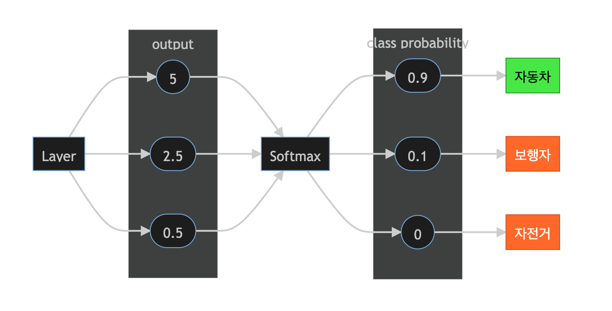
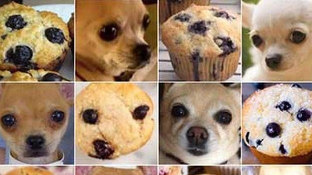
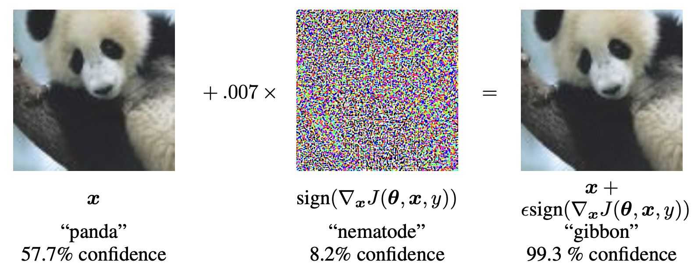
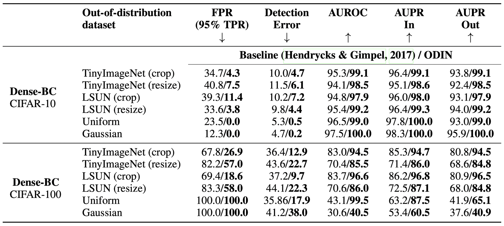
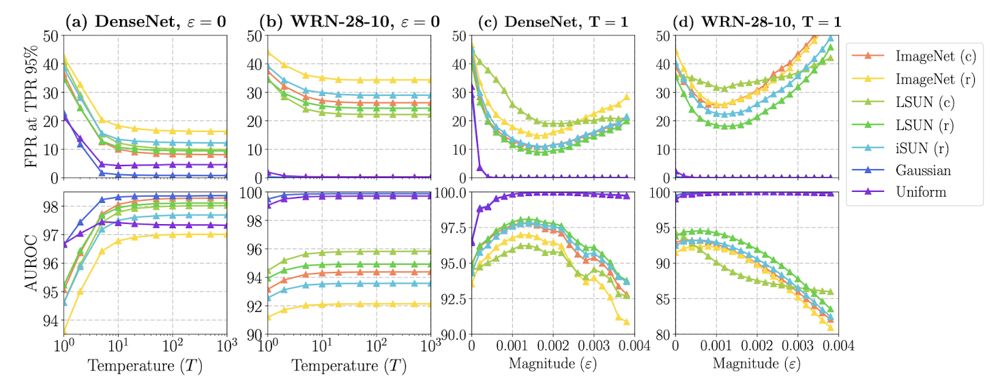
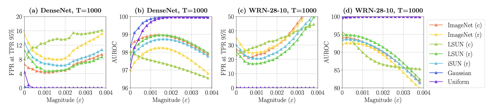
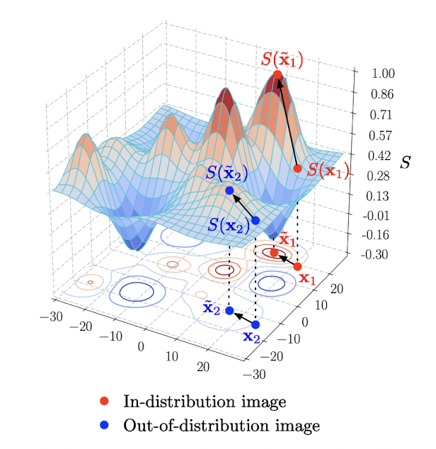

<!-- _color: white -->

# Enhancing The Reliability of Out-of-distribution Image Detection in Neural Networks
###### Shiyu Liang, Yixuan Li, R. Srikant 
 

> Grepp
  Zayden

---

## 목차

1. Intorduction
2. Problem statement
3. ODIN
4. Experiments
5. Discussions
6. Q&A

---
<!-- _header: Introduction -->
# 딥러닝 모델의 학습
훈련 데이터의 분포와 테스트 데이터의 분포가 비슷할때 테스트 데이터에 대한 모델의 성능이 높다. 
 

## 실제로 모델을 배포한다면?  

- 실제 상황에서는 모델의 <hl>훈련과정에서 접하지 않은 다양한 분포의 데이터</hl>를 마주할 수 있다.   
- 새로운 종류1)의 데이터 <comp>(Out-Of-Distribution; OOD)</comp>를 모델에 넣는경우 특정 class로 분류되기 때문에 <hl>기대와 다르게 특정 class에 높은 확률값을 보이는 경우가 많다</hl>.

<!-- _footer: 1) 처음보거나, 분류가 불가능하거나, 관련없는 데이터 -->
---
<!-- _header: Introduction -->
# Out-Of-Distribution (OOD)
예측가능한 분포안에 있는 데이터 <comp>(In-Distribution; ID)</comp>와 다르게 분류할 수 없는 OOD를 판별하는것이 중요하다.

일반적으로 잘 학습된 딥러닝 모델은 OOD보다 ID에 높은 확률값을 보인다

- softmax에 temperature scaling를 추가
- 입력에 노이즈1) 추가
 

-> <hl>ID와 OOD 사이의 softmax score 차이가 커짐</hl>

<!-- _footer: 1) 논문에는 perbutation으로 되어있고 데이터에 포함된 복잡한, 교란시키는 정도의 의미  -->

---
<!-- _header: Problem statement -->

# 문제 정의
이미지 $P_\bold{X}$와 $Q_\bold{X}$가 $P_\bold{X} Q_\bold{X} \in \mathcal{X}$일때  
혼합 분포를 가지는 새로운 이미지 $\mathbb{P}_{\bold{X}|Z} \in \mathcal{X} \times {(0, 1)}$가 아래와 같을때,
 
 - $\mathbb{P}_{\bold{X}|Z=0} =P_\bold{X}$ -> In distribution
 - $\mathbb{P}_{\bold{X}|Z=1} =Q_\bold{X}$ -> Out distribution

 

-> $\mathbb{P}_{\bold{X}|Z}$ 분포를 가진 이미지 $\bold{X}$가 주어지면 이 이미지를 $P_\bold{X}$인지 아닌지 분류할 수 있을까?

---
<!-- _header: ODIN -->
# ODIN <comp>(Out-of-DIstribution detector for Neural net- works)</comp>

---
<!-- _header: ODIN -->
# Contributions
- 딥러닝 모델의 재학습이 필요없다!
- 최신 모델들에도 쉽게 적용할 수 있다!
- 기존의 baseline model보다 큰폭으로 성능이 향상되었다!
- 하이퍼 파라미터의 직관적 선택이 가능하도록 실험을 많이 진행하였다! 
  
---
<!-- _header: ODIN -->
## 1. Temperature scaling

---
<!-- _header: ODIN - Temperature scaling -->
# Softmax
 

---
<!-- _header: ODIN - Temperature scaling -->
모델의 출력으로부터 각 class에 대한 class confidence를 구하기위해 사용하는 Softmax는 다음과 같이 정의된다.

$$ S_i(x) = {\exp f_i(x) \over \sum^{N}_{j=1} \exp f_j(x)} $$

 

이때 출력 class는 <hl>$argmax_iS_i(x)$</hl>로 선택한다.

---
<!-- _header: ODIN - Temperature scaling -->
$T$가 양의 실수일때 Temperature scaling은 아래와 같이 적용한다.
 

$$ S_i(x, T) = {\exp f_i(x / T) \over \sum^{N}_{j=1} \exp f_j(x/T)} $$
 

---
<!-- _header: ODIN - Temperature scaling -->
# Temperature Scaling의 영향  
- softmax의 argmax에 영향이 없이 <hl>Calibration</hl>을 수행할 수 있음.
  - 특정 class에 over confidence하는 현상을 줄일 수 있음. (soften)

 

### Calibration
단순히 높은 Confidence를 선택해서 결정되는 Accuracy가 아닌 실제 class에 대한 confidence를 따라가게 하는것.

---
<!-- _header: ODIN - Temperature scaling -->
# Calibration
- `강아지`:`머핀` 
  - <b>`0.9`:`0.1`</b> -> 실제 딥러닝 모델의 출력은 맞으나 confidence가 과도함
  - <b>`0.6`:`0.4`</b>  -> 실제 현실에서의 class confidence와 비슷

---
<!-- _header: ODIN - Input pre-processing -->
## 2. Input pre-processing

---
<!-- _header: ODIN - Input pre-processing -->
# Inspired
<comp>Goodfellow et al., 2015</comp>의 FGSM에서 영감을 얻음
- gradient에 의한 작은 perturbation을 이용해 softmax score를 낮춰서 입력 이미지를 다른 class로 오해하게 만드는 기법

---
<!-- _header: ODIN - Input pre-processing -->
## 반대로!
입력 이미지에 대한 softmax score를 높이는 방향으로 perturbation을 추가한다.
 

$$\tilde{x}=x-\epsilon sign(-\nabla_xlogS_{\hat y}(x;T)),$$

---
<!-- _header: ODIN -->
<hl>앞서 두가지 방법을 조합하자!</hl>
# Out-of-distribution Detector
perturbation을 추가한 데이터에 대한 모델의 출력에 Temperature scaling을 적용

- threshold $\delta$보다 출력 확률이 낮거나 같은 경우 -> <b>OOD</b>
- threshold $\delta$보다 출력 확률이 높은 경우 -> <b>ID</b>
 

$$g(x;\delta;T;\epsilon)=\begin{cases} {1 \quad \mathrm{if} \ \ max_i\ p(\tilde{x};T)\leq \delta },\\{0 \quad \mathrm{if} \ \ max_i\ p(\tilde{x};T)> \delta}. \end{cases}$$

---
<!-- _header: Experiments -->
# Discussion

---
<!-- _header: Experiments -->
## Trained models

- DenseNet <comp>(Huang et al., 2016)</comp>
- Wide ResNet <comp>(Zagoruyko & Komodakis, 2016)</comp>
 

### Trained model error rate

|<hl>Architecture</hl>|<hl>CIFAR-10</hl>|<hl>CIFAR-100</hl>|
|:-----:|:-----:|:-----:|
|<b>Dense-BC</b>|4.81|22.37|
|<b>WRN-28-10</b>|3.71|19.86|

---
<!-- _header: Experiments -->
## Out-of-distribution Datsets
학습된 모델이 CIFAR-10, CIFAR-100에 대해 학습되어 있어서 한번도 보여지지 않은 데이터를 OOD로 테스트 하기위해서 아래와 같은 데이터를 이용함
 

1. TinyImageNet
2. LSUN
3. Gaussian Noise
4. Uniform Noise

---
<!-- _header: Experiments -->
## Evaluation Metrics
 
 
 

|Predicted Real|<b>Positive</b>|<b>Negative</b>|
|:-----:|:-----:|:-----:|
|<b>Positive</b>|TP|FP|
|<b>Negative</b>|FN|TN|

 
 

---
<!-- _header: Experiments -->
- <b>민감도(Sensitivity, TPR, Recall)</b>
  실제 Positive중에서 Postive로 예측된 비율
- <b>특이도(Specificity, TNR)</b>
  실제 Negative중에서 Negative로 예측된 비율
- <b>FPR</b>
  실제 Negative중에서 Posivie로 예측된 비율
- <b>정밀도 (Precision)</b>
  Positive로 예측된 값중에서 실제 Positive의 비율

---
<!-- _header: Experiments -->
# OOD Test Metric

1. <b>FPR@TPR=0.95</b>
   True Positive Rate가 95%일때 False Positive Rate
2. <b>Detection Error</b>
   TPR이 95%일때 잘못 classify할 확률 ($P_e = 0.5(1 − TPR) + 0.5FPR$)
3. <b>AUROC (Area Under the Receiver Operating Characteristic curve)</b>
   Classify Threshold를 조절하면서 TPR/FPR 그래프 아래 면적
4. <b>AUPR</b>
   Classify Threshold를 조절하면서 Precision/recall 커브의 아래 면적
  
---
# Result

---
<!-- _header: Discussion -->
# Discussion

---
<!-- _header: Discussion -->
### The effects of $T$

---
<!-- _header: Discussion -->
### The effects of gradient $\nabla_xlogS(x;T)$

---
<!-- _header: Discussion -->
## The effects of $\epsilon$

- $\epsilon$이 작은 값일때는 큰 영향이 없지만 무시할 수 없을정도의 값을 가지는 경우 preprocessing을 거친 이미지는 $||\nabla_xlogS(x;T)||_1$의 영향을 받는다.
- 하지만 $\epsilon$이 너무 큰경우 classification 성능이 감소한다.

---

# Q&A

---
### References
- <comp>Ian J Goodfellow, Jonathon Shlens, and Christian Szegedy. Explaining and harnessing adversarial examples. ICLR, 2015.</comp>
- <comp>Gao Huang, Zhuang Liu, and Kilian Q Weinberger. Densely connected convolutional networks. arXiv preprint arXiv:1608.06993, 2016.</comp>
- <comp>Kaiming He, Xiangyu Zhang, Shaoqing Ren, and Jian Sun. Deep residual learning for image recognition. In CVPR, 2016.</comp>
